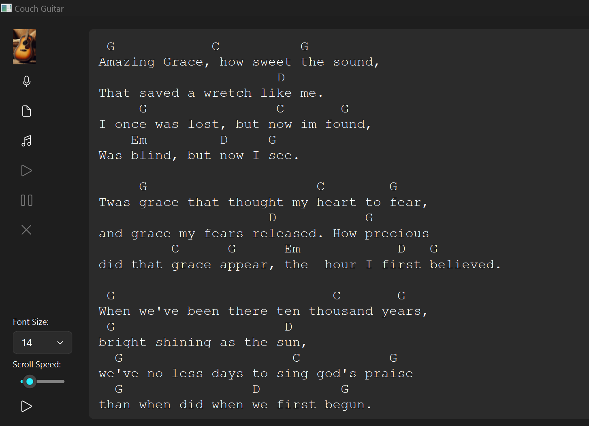

# Couch Guitar

Couch Guitar is a PyQt6-based application designed for home musicians who want to display song lyrics, guitar tabs, and chords in a teleprompter-style interface. This small, open-source app allows musicians to load text files with lyrics, adjust the font size, control scroll speed, and even record practice sessions with audio playback capabilities.

## Features
- **Auto-Scrolling Lyrics and Tabs**: Display text files with lyrics and chords, and scroll them automatically to follow along while playing.
- **Font and Speed Controls**: Adjust font size and scrolling speed to suit your preference.
- **Audio Recording and Playback**: Record practice sessions and play back recorded audio for review.

## Installation

You can install Couch Guitar directly from PyPI:

```bash
pip install couchguitar
```

Or, if you prefer, you can clone the repository and install it locally:

```bash
git clone https://github.com/scottpeterman/couchguitar.git
cd couchguitar
pip install .
```

## Usage

To run the app, simply use the following command in your terminal:

```bash
couchguitar
```

Once launched, use the navigation bar on the left to:
- **Load Songs**: Load text files with lyrics and chords for display.
- **Control Scroll**: Play, pause, and adjust scrolling speed.
- **Record Audio**: Record audio sessions up to 15 minutes and save as `.wav`.

### Example

Here’s an example of Couch Guitar in use:



> **Note**: The image `example.png` should be located in the `screenshots` directory.

